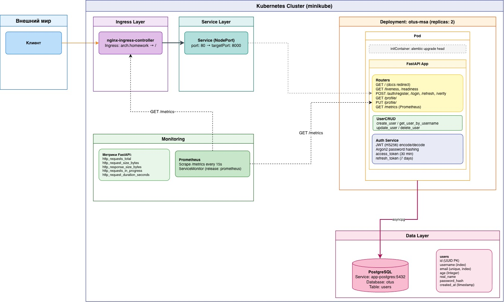

# Взаимодействие пользователя с сервисом 
- клиент делает запрос к сервису через nginx-ingress-controller 

## Эндпоинты регистрации

### POST /auth/register 
Позволяет зарегистрироваться. На вход принимает данные о пользователе 

На вход принимает запрос вида:
  ```json
  {"username":"name", "email":"name@domain.dm", "password":"some_pass", "age":18, "real_name":"Ivan"}
  ```
  На выходе получает refresh_token и access_token

### POST /auth/login
Позволяет войти в систему, путем передачи логиан (username) и пароля. На выходе получает токены

### POST /auth/verify 
Проверка валидности access_token

### POST /auth/refresh
Обновление времени жизни access_token

## Эндпоинты доступа к профилю

### GET /profile
Доступ к своему профилю. Осуществляется только для авторизованных пользователей

### PUT /profile
Изменение данных профиля. Осуществляется только для авторизованных пользователей. Можно менять email, real_name, age

## Схема взаимодействия


## Установка

Установка API Gateway (из папки nginx-ingress-controller): 
```bash
cd nginx-ingress-controller
helm install ingress-nginx ingress-nginx/ingress-nginx --namespace ingress-nginx --create-namespace --values values.yaml
```

Установка приложения (из папки app)
```bash
cd app
helm upgrade app ./helm --timeout 2m --debug --install --wait --atomic --namespace default --values ./helm/values.yaml
```

## Тестирование

### Запуск тестов
```bash
newman run app/tests/otus-msa-api-tests.postman_collection.json
```

Итоги тестирования (подробнее в [tests.txt](../app/tests/tests.txt)):

```
┌─────────────────────────┬──────────────────┬──────────────────┐
│                         │         executed │           failed │
├─────────────────────────┼──────────────────┼──────────────────┤
│              iterations │                1 │                0 │
├─────────────────────────┼──────────────────┼──────────────────┤
│                requests │               13 │                0 │
├─────────────────────────┼──────────────────┼──────────────────┤
│            test-scripts │               13 │                0 │
├─────────────────────────┼──────────────────┼──────────────────┤
│      prerequest-scripts │                7 │                0 │
├─────────────────────────┼──────────────────┼──────────────────┤
│              assertions │               40 │                0 │
├─────────────────────────┴──────────────────┴──────────────────┤
│ total run duration: 383ms                                     │
├───────────────────────────────────────────────────────────────┤
│ total data received: 2.62kB (approx)                          │
├───────────────────────────────────────────────────────────────┤
│ average response time: 17ms [min: 3ms, max: 68ms, s.d.: 19ms] │
└───────────────────────────────────────────────────────────────┘

```
