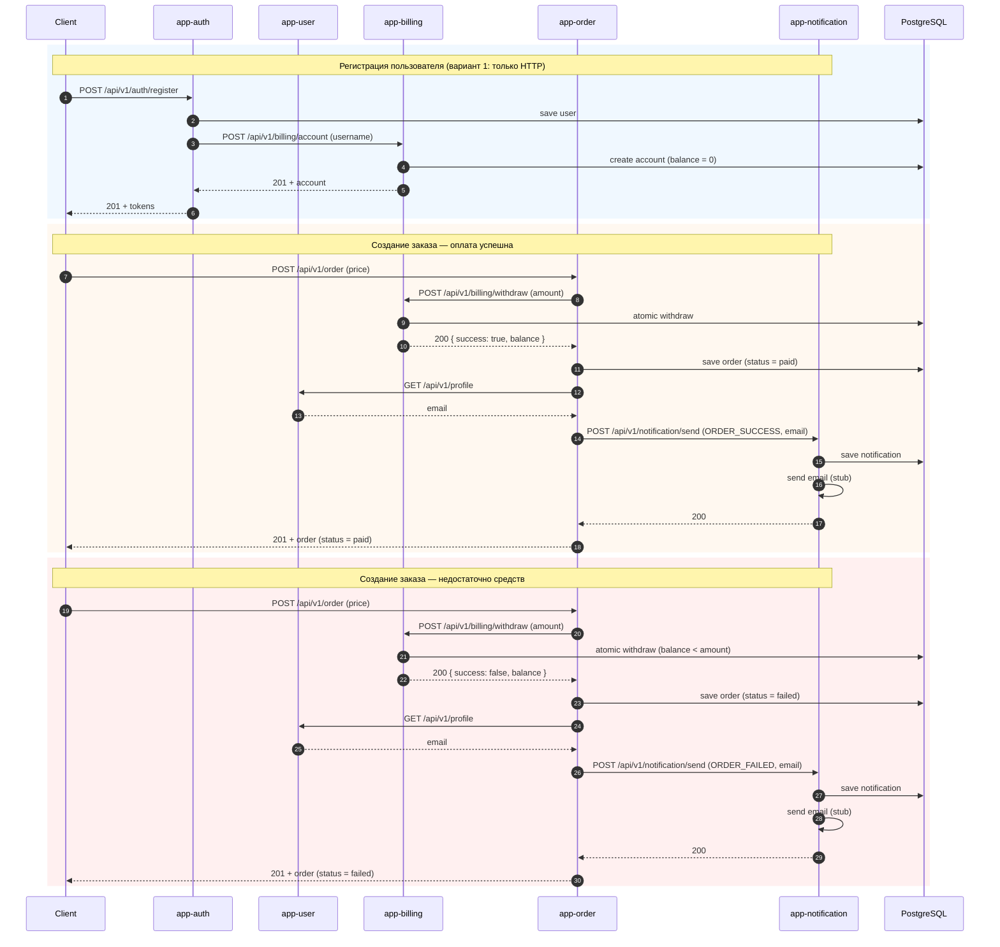
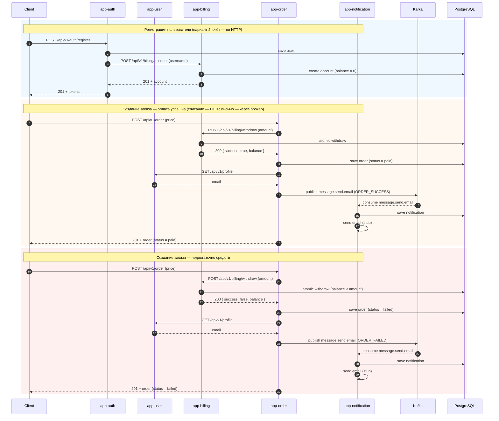
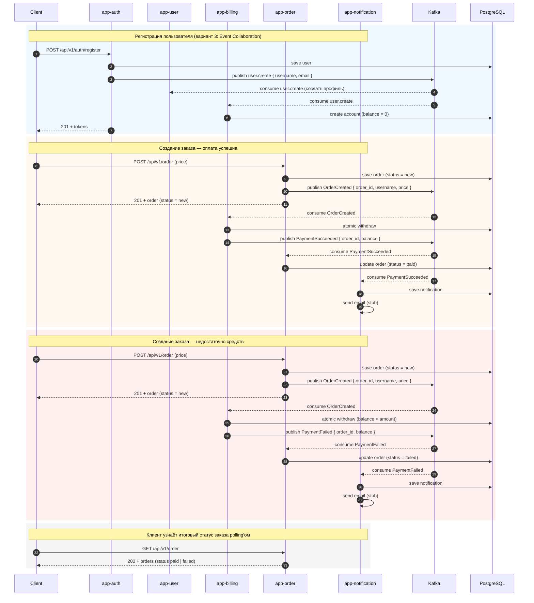
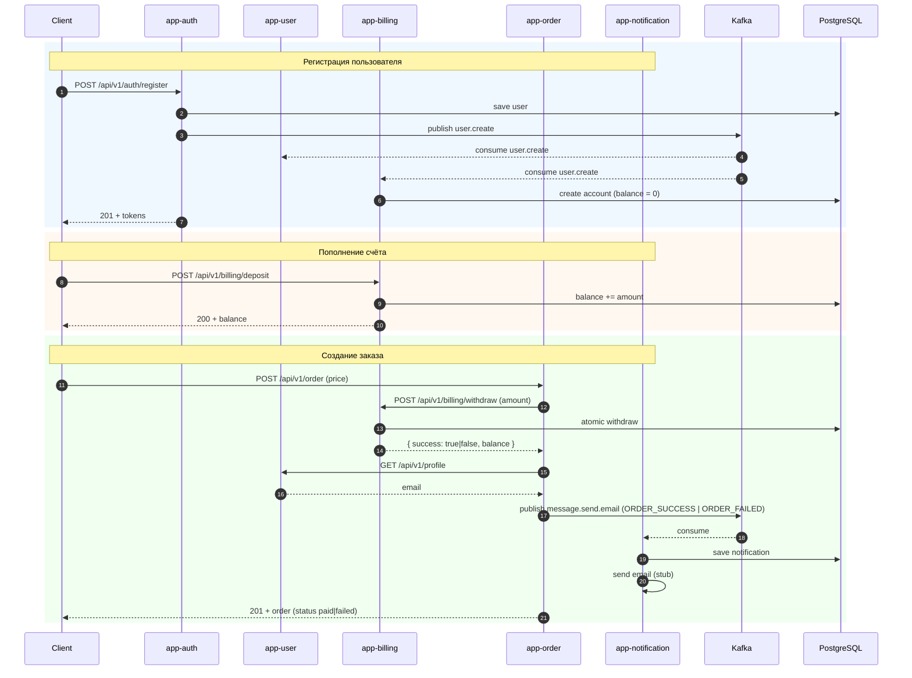

# Теоретическая часть: варианты взаимодействия сервисов при создании заказа

## Вариант 1 — только HTTP-взаимодействие



Плюсы: 
* простая и предсказуемая модель — каждый запрос либо успешен, либо ошибка видна немедленно;
* просто в отладке;
* не нужен брокер сообщений и его эксплуатация.

Минусы: 
* жёсткая связность — падение всех реплик app-billing или app-notification блокирует регистрацию/заказ; 
* время выполнения запроса складывается из времени всей цепочки;
* масштабировать приходится всю цепочку сразу.

Не стоит выбирать этот вариант для проектирования отказоустойчивой и правильно масштабируемой системы. Можно использовать только на самом старте, когда нужно срочно MVP, а в команде нет роли DevOPS для поддержки брокера.  


## Вариант 2 — брокер сообщений только для нотификаций



Плюсы: 
* ответ клиенту не ждёт отправки письма; 
* временная недоступность app-notification не роняет создание заказа (событие дождётся потребителя в брокере).

Минусы: 
* нужно эксплуатировать брокер; 
* регистрация синхронно зависит от биллинга.

Выделить уведомления для асинхронной обработки — правильно решение, но это не единственная операция, которая может быть переведена на работу через брокер. Система уже получает сложность (из-за брокера), но не дает всех преимуществ MSA. Вариант не рекомендуется.

## Вариант 3 — Event Collaboration (всё через события)



Плюсы: 
* минимальная связность, каждый сервис автономен и реагирует на события; 
* легко добавлять новых потребителей (например, аналитику) без изменения продюсеров; 
* высокая устойчивость к отказам отдельных сервисов. 

Минусы: 
* клиент не получает результат платежа синхронно — для денег это спорно (заказ «успешно принят», а оплата может не пройти); 
* сложнее отладка и трассировка распределённого сценария; 
* нужна обработка дубликатов и гарантий доставки; 
* общая сложность эксплуатации выше.

Операция списания денег должна быть синхронной, чтобы при создании заказа через один единственный запрос отдавался итоговой статус. Либо мы создаем заказ, либо не создаем.

## Вариант 4 — HTTP-взаимодействие для создания заказа



Обоснование выбора: 
1. Платёж — операция, где асинхронность вредит UX и усложняет процесс взаимодействия с бэком, поэтому
взаимодействие с биллингом остаётся синхронным. 
2. Уведомления и создание счёта/профиля не участвуют в ответе клиенту и отлично переносят eventual consistency, а событийная модель снимает жёсткую зависимость регистрации и заказа от доступности app-notification и app-billing. 

Такой гибрид даёт основные плюсы событийной архитектуры (слабая связность, устойчивость к отказам) там, где они уместны и позволяет масштабировать только нагруженные сервисы.

# Практическая часть

## Описание архитектурного решения и схема взаимодействия сервисов (в виде картинки)

[Выбранный вариант описан в этом разделе](#вариант-4--http-взаимодействие-для-создания-заказа)

Если схема *.mermaid не открывается, то доступна картинка: [hw7-architecture.png](hw7-architecture.png)

## Команда установки приложения (из helm-а или из манифестов). Обязательно указать в каком namespace нужно устанавливать.

### Установка инфраструктуры

Процесс установки инфраструктуры описан [здесь](../readme.md#установка-инфраструктуры) и включает в себя разворачивание Kafka, PostgreSQL, Prometheus+Grafana, Nginx Ingress Controller

### Установка приложения

####  Деплой через helmfile (если установлен, предпочтительно)
```shell
helmfile \
  --state-values-set app_auth.image.tag=auth-2026-08-03-2333 \
  --state-values-set app_billing.image.tag=billing-2026-08-03-2333 \
  --state-values-set app_frontend.image.tag=frontend-2026-08-04-0624 \
  --state-values-set app_notification.image.tag=notification-2026-08-03-2333 \
  --state-values-set app_order.image.tag=order-2026-08-03-2333 \
  --state-values-set app_user.image.tag=user-2026-08-03-2333 \
  sync

```

#### Раздельный деплой через helm 
```shell
helm upgrade app-auth ./charts/chart-app-auth --install --namespace default \
--set image.tag=auth-2026-08-03-2333 --values ./charts/chart-app-auth/values.yaml
helm upgrade app-billing ./charts/chart-app-billing --install --namespace default \
--set image.tag=billing-2026-08-03-2333 --values ./charts/chart-app-billing/values.yaml
helm upgrade app-frontend ./charts/chart-app-frontend --install --namespace default \
--set image.tag=frontend-2026-08-04-0624 --values ./charts/chart-app-frontend/values.yaml
helm upgrade app-notification ./charts/chart-app-notification --install --namespace default \
--set image.tag=notification-2026-08-03-2333 --values ./charts/chart-app-notification/values.yaml
helm upgrade app-order ./charts/chart-app-order --install --namespace default \
--set image.tag=order-2026-08-03-2333 --values ./charts/chart-app-order/values.yaml
helm upgrade app-user ./charts/chart-app-user --install --namespace default \
--set image.tag=user-2026-08-03-2333 --values ./charts/chart-app-user/values.yaml
```

## Запуск тестов Postman

Коллекция: [postman/otus-msa-hw7.postman_collection.json](postman/otus-msa-hw7.postman_collection.json)

```shell
newman run postman/otus-msa-hw7.postman_collection.json
```

`baseUrl` уже задан в коллекции (`arch.homework`). При необходимости его можно переопределить

Результат работы тестов:
```
OTUS MSA HW7 — Billing / Order / Notification

❏ 1. Auth
↳ Register user
  POST http://arch.homework/api/v1/auth/register [201 Created, 514B, 79ms]
  ┌
  │ 'REQUEST:', 'Register user', 'POST', 
  │ 'http://arch.homework/api/v1/auth/register'
  │ 'REQUEST BODY:', '{\n' +
  │   '  "username": "River.Carter72",\n' +
  │   '  "email": "admin@cianoid.ru",\n' +
  │   '  "password": "password123"\n' +
  │   '}'
  │ 'RESPONSE:', 201, '{"access_token":"eyJhbGciOiJIUzI1
  │ NiIsInR5cCI6IkpXVCJ9.eyJzdWIiOiJSaXZlci5DYXJ0ZXI3MiIsImV4cCI6MTc4NTgxNzU1NSwidHlwZSI6ImFjY2VzcyJ9
  │ .so0xsiQruCXsOnQB6oONskFqCrEMbbkGRnLApYBJODk","refresh_token":"eyJhbGciOiJIUzI1NiIsInR5cCI6IkpXVC
  │ J9.eyJzdWIiOiJSaXZlci5DYXJ0ZXI3MiIsImV4cCI6MTc4NjQyMDU1NSwidHlwZSI6InJlZnJlc2gifQ.SiUi-hFMZGBQand
  │ 1qdbqTWqKn7F4uVq-UuEYpKBhybE","token_type":"bearer"}'
  └
  ✓  Status is 201

❏ 2. Billing
↳ Deposit money
  POST http://arch.homework/api/v1/billing/deposit [200 OK, 181B, 10ms]
  ┌
  │ 'REQUEST:', 'Deposit money', 'POST', 
  │ 'http://arch.homework/api/v1/billing/deposit'
  │ 'REQUEST BODY:', '{\n  "amount": 1000\n}'
  │ 'RESPONSE:', 200, '{"username":"River.Carter72","bal
  │ ance":"1000.00"}'
  └
  ✓  Status is 200

↳ Get account balance
  GET http://arch.homework/api/v1/billing/account [200 OK, 181B, 4ms]
  ┌
  │ 'REQUEST:', 'Get account balance', 'GET', 
  │ 'http://arch.homework/api/v1/billing/account'
  │ 'REQUEST BODY: <none>'
  │ 'RESPONSE:', 200, '{"username":"River.Carter72","bal
  │ ance":"1000.00"}'
  └
  ✓  Status is 200

❏ 3. Order — enough money
↳ Create order (success)
  POST http://arch.homework/api/v1/order [201 Created, 287B, 27ms]
  ┌
  │ 'REQUEST:', 'Create order (success)', 'POST'[3[39m
  │ 7m, 'http://arch.homework/api/v1/order'                                                            
  │ 'REQUEST BODY:', '{\n  "price": 500\n}'
  │ 'RESPONSE:', 201, '{"id":"5aa429e0-4fda-4bbb-ad4d-9d
  │ 9bf6a0950b","username":"River.Carter72","price":"500.00","status":"paid","created_at":"2026-08-04
  │ T03:55:55.246992Z"}'
  └
  ✓  Status is 201

↳ Get balance after order
  GET http://arch.homework/api/v1/billing/account [200 OK, 180B, 4ms]
  ┌
  │ 'REQUEST:', 'Get balance after order', 'GET'[3[39m
  │ 7m, 'http://arch.homework/api/v1/billing/account'                                                  
  │ 'REQUEST BODY: <none>'
  │ 'RESPONSE:', 200, '{"username":"River.Carter72","bal
  │ ance":"500.00"}'
  └
  ✓  Status is 200

↳ Check notification (success)
  GET http://arch.homework/api/v1/notification [200 OK, 784B, 6ms]
  ┌
  │ 'REQUEST:', 'Check notification (success)', 'GET'[3[39m
  │ 9m, 'http://arch.homework/api/v1/notification'                                                     
  │ 'REQUEST BODY: <none>'
  │ 'RESPONSE:', 200, '[{"id":"5aa429e0-4fda-4bbb-ad4d-9
  │ d9bf6a0950b","username":"River.Carter72","email":"admin@cianoid.ru","message_type":"ORDER_SUCCESS
  │ ","subject":"Заказ успешно оформлен","body":"<!doctype html>\\n<html lang=\\"ru\\">\\n  <body>\\n
  │     <h1>Здравствуйте, River.Carter72!</h1>\\n    <p>Ваш заказ №5aa429e0-4fda-4bbb-ad4d-9d9bf6a095
  │ 0b успешно оформлен.</p>\\n    <p>\\n      Стоимость заказа: 500<br>\\n      Остаток на счёте: 50
  │ 0.00\\n    </p>\\n    <p>Спасибо за покупку!</p>\\n  </body>\\n</html>","created_at":"2026-08-04T
  │ 03:55:55.259733Z","status":"READY_TO_SEND"}]'
  └
  ✓  Status is 200

Attempting to set next request to Check notification (success)

↳ Check notification (success)
  GET http://arch.homework/api/v1/notification [200 OK, 775B, 10ms]
  ┌
  │ 'REQUEST:', 'Check notification (success)', 'GET'[3[39m
  │ 9m, 'http://arch.homework/api/v1/notification'                                                     
  │ 'REQUEST BODY: <none>'
  │ 'RESPONSE:', 200, '[{"id":"5aa429e0-4fda-4bbb-ad4d-9
  │ d9bf6a0950b","username":"River.Carter72","email":"admin@cianoid.ru","message_type":"ORDER_SUCCESS
  │ ","subject":"Заказ успешно оформлен","body":"<!doctype html>\\n<html lang=\\"ru\\">\\n  <body>\\n
  │     <h1>Здравствуйте, River.Carter72!</h1>\\n    <p>Ваш заказ №5aa429e0-4fda-4bbb-ad4d-9d9bf6a095
  │ 0b успешно оформлен.</p>\\n    <p>\\n      Стоимость заказа: 500<br>\\n      Остаток на счёте: 50
  │ 0.00\\n    </p>\\n    <p>Спасибо за покупку!</p>\\n  </body>\\n</html>","created_at":"2026-08-04T
  │ 03:55:55.259733Z","status":"SENT"}]'
  └
  ✓  Status is 200

❏ 4. Order — not enough money
↳ Create order (failed)
  POST http://arch.homework/api/v1/order [201 Created, 290B, 26ms]
  ┌
  │ 'REQUEST:', 'Create order (failed)', 'POST'[37[39m
  │ m, 'http://arch.homework/api/v1/order'                                                             
  │ 'REQUEST BODY:', '{\n  "price": 9999\n}'
  │ 'RESPONSE:', 201, '{"id":"6d537ecf-a123-4e4b-a353-c5
  │ eee86357e8","username":"River.Carter72","price":"9999.00","status":"failed","created_at":"2026-08
  │ -04T03:55:56.340644Z"}'
  └
  ✓  Status is 201

↳ Get balance after failed order
  GET http://arch.homework/api/v1/billing/account [200 OK, 180B, 6ms]
  ┌
  │ 'REQUEST:', 'Get balance after failed order', 'GET'[39m
  │ [39m, 'http://arch.homework/api/v1/billing/account'                                                
  │ 'REQUEST BODY: <none>'
  │ 'RESPONSE:', 200, '{"username":"River.Carter72","bal
  │ ance":"500.00"}'
  └
  ✓  Status is 200

↳ Check notification (failed)
  GET http://arch.homework/api/v1/notification [200 OK, 1.5kB, 4ms]
  ┌
  │ 'REQUEST:', 'Check notification (failed)', 'GET'[39[39m
  │ m, 'http://arch.homework/api/v1/notification'                                                      
  │ 'REQUEST BODY: <none>'
  │ 'RESPONSE:', 200, '[{"id":"6d537ecf-a123-4e4b-a353-c
  │ 5eee86357e8","username":"River.Carter72","email":"admin@cianoid.ru","message_type":"ORDER_FAILED"
  │ ,"subject":"Не удалось оформить заказ","body":"<!doctype html>\\n<html lang=\\"ru\\">\\n  <body>\
  │ \n    <h1>Здравствуйте, River.Carter72!</h1>\\n    <p>К сожалению, заказ №6d537ecf-a123-4e4b-a353
  │ -c5eee86357e8 не удалось оформить.</p>\\n    <p>\\n      Стоимость заказа: 9999<br>\\n      Текущ
  │ ий баланс: 500.00\\n    </p>\\n    <p>Пожалуйста, пополните счёт и попробуйте снова.</p>\\n  </bo
  │ dy>\\n</html>","created_at":"2026-08-04T03:55:56.350576Z","status":"READY_TO_SEND"},{"id":"5aa429
  │ e0-4fda-4bbb-ad4d-9d9bf6a0950b","username":"River.Carter72","email":"admin@cianoid.ru","message_t
  │ ype":"ORDER_SUCCESS","subject":"Заказ успешно оформлен","body":"<!doctype html>\\n<html lang=\\"r
  │ u\\">\\n  <body>\\n    <h1>Здравствуйте, River.Carter72!</h1>\\n    <p>Ваш заказ №5aa429e0-4fda-4
  │ bbb-ad4d-9d9bf6a0950b успешно оформлен.</p>\\n    <p>\\n      Стоимость заказа: 500<br>\\n      О
  │ статок на счёте: 500.00\\n    </p>\\n    <p>Спасибо за покупку!</p>\\n  </body>\\n</html>","creat
  │ ed_at":"2026-08-04T03:55:55.259733Z","status":"SENT"}]'
  └
  ✓  Status is 200

Attempting to set next request to Check notification (failed)

↳ Check notification (failed)
  GET http://arch.homework/api/v1/notification [200 OK, 1.49kB, 16ms]
  ┌
  │ 'REQUEST:', 'Check notification (failed)', 'GET'[39[39m
  │ m, 'http://arch.homework/api/v1/notification'                                                      
  │ 'REQUEST BODY: <none>'
  │ 'RESPONSE:', 200, '[{"id":"6d537ecf-a123-4e4b-a353-c
  │ 5eee86357e8","username":"River.Carter72","email":"admin@cianoid.ru","message_type":"ORDER_FAILED"
  │ ,"subject":"Не удалось оформить заказ","body":"<!doctype html>\\n<html lang=\\"ru\\">\\n  <body>\
  │ \n    <h1>Здравствуйте, River.Carter72!</h1>\\n    <p>К сожалению, заказ №6d537ecf-a123-4e4b-a353
  │ -c5eee86357e8 не удалось оформить.</p>\\n    <p>\\n      Стоимость заказа: 9999<br>\\n      Текущ
  │ ий баланс: 500.00\\n    </p>\\n    <p>Пожалуйста, пополните счёт и попробуйте снова.</p>\\n  </bo
  │ dy>\\n</html>","created_at":"2026-08-04T03:55:56.350576Z","status":"SENT"},{"id":"5aa429e0-4fda-4
  │ bbb-ad4d-9d9bf6a0950b","username":"River.Carter72","email":"admin@cianoid.ru","message_type":"ORD
  │ ER_SUCCESS","subject":"Заказ успешно оформлен","body":"<!doctype html>\\n<html lang=\\"ru\\">\\n 
  │  <body>\\n    <h1>Здравствуйте, River.Carter72!</h1>\\n    <p>Ваш заказ №5aa429e0-4fda-4bbb-ad4d-
  │ 9d9bf6a0950b успешно оформлен.</p>\\n    <p>\\n      Стоимость заказа: 500<br>\\n      Остаток на
  │  счёте: 500.00\\n    </p>\\n    <p>Спасибо за покупку!</p>\\n  </body>\\n</html>","created_at":"2
  │ 026-08-04T03:55:55.259733Z","status":"SENT"}]'
  └
  ✓  Status is 200

┌─────────────────────────┬──────────────────┬──────────────────┐
│                         │         executed │           failed │
├─────────────────────────┼──────────────────┼──────────────────┤
│              iterations │                1 │                0 │
├─────────────────────────┼──────────────────┼──────────────────┤
│                requests │               11 │                0 │
├─────────────────────────┼──────────────────┼──────────────────┤
│            test-scripts │               11 │                0 │
├─────────────────────────┼──────────────────┼──────────────────┤
│      prerequest-scripts │                0 │                0 │
├─────────────────────────┼──────────────────┼──────────────────┤
│              assertions │               11 │                0 │
├─────────────────────────┴──────────────────┴──────────────────┤
│ total run duration: 2.3s                                      │
├───────────────────────────────────────────────────────────────┤
│ total data received: 4.89kB (approx)                          │
├───────────────────────────────────────────────────────────────┤
│ average response time: 17ms [min: 4ms, max: 79ms, s.d.: 21ms] │
└───────────────────────────────────────────────────────────────┘
```
